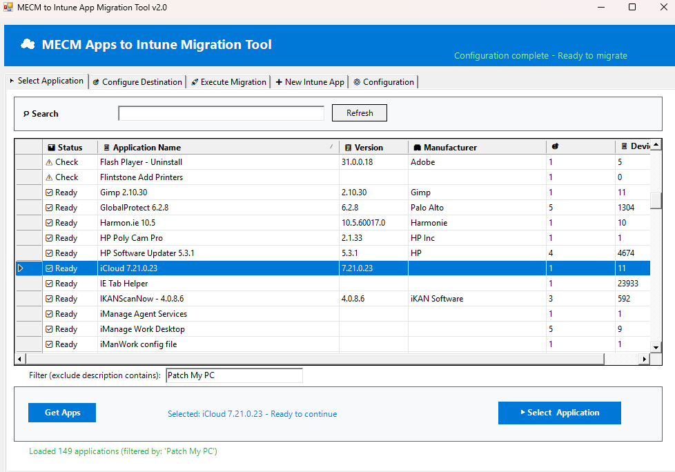

# MECM to Intune Application Migration Tool

A comprehensive PowerShell tool with GUI for migrating applications from Microsoft Endpoint Configuration Manager (MECM/SCCM) to Microsoft Intune. This tool automates the complex process of analyzing MECM applications, validating their migratability, and packaging them for deployment through Intune.

## 🚀 Features

- **GUI-Based Interface**: User-friendly Windows Forms interface for easy operation
- **MECM Integration**: Direct connection to MECM infrastructure for application discovery
- **Smart Migration Analysis**: Automatically validates application migratability
- **Icon Extraction**: Preserves application icons during migration
- **Multiple Detection Methods**: Supports MSI, Registry, and File-based detection rules
- **Version Management**: Organized folder structure for version control
- **Intune Publishing**: Direct integration with Microsoft Intune for app deployment
- **Comprehensive Logging**: Detailed logging for troubleshooting and audit trails
- **Batch Processing**: Process multiple applications efficiently
- **What-If Mode**: Preview changes before executing

## 📋 Prerequisites

### Required Software
- **Windows PowerShell 5.1** or **PowerShell 7+**
- **Microsoft Configuration Manager Console** (MECM Admin Console)
- **.NET Framework 4.7.2** or higher

### Required PowerShell Modules
- **ConfigurationManager** (included with MECM Admin Console)
- **IntuneWin32App** (auto-installed by the script)

### Required Permissions
- **MECM**: Read access to applications and deployment types
- **Intune**: Global Administrator or Intune Administrator role
- **File System**: Read/write access to source file locations and output directories

### Azure App Registration
You'll need an Azure App Registration with the following Microsoft Graph permissions:
- `DeviceManagementApps.ReadWrite.All`
- `DeviceManagementConfiguration.ReadWrite.All`

## 🛠️ Installation

1. **Clone the repository**:
   ```powershell
   git clone https://github.com/yourusername/MECM-to-Intune-Apps.git
   cd MECM-to-Intune-Apps
   ```

2. **Configure the application**:
   - Copy `Scripts/config.example.json` to `Scripts/config.json`
   - Update the configuration with your environment details

3. **Set execution policy** (if needed):
   ```powershell
   Set-ExecutionPolicy -ExecutionPolicy RemoteSigned -Scope CurrentUser
   ```

## ⚙️ Configuration

Edit `Scripts/config.json` with your environment details:

```json
{
    "MECMSiteServer": "your-mecm-server.domain.local",
    "MECMSiteCode": "ABC",
    "BaseAppPath": "\\\\server\\share\\IntuneApps",
    "BaseSourcePath": "\\\\server\\share\\SourceFiles",
    "TenantId": "your-tenant-id-guid",
    "ClientId": "your-client-id-guid",
    "ClientSecret": "your-client-secret"
}
```

### Configuration Parameters

| Parameter | Description | Example |
|-----------|-------------|---------|
| `MECMSiteServer` | MECM Site Server FQDN | `mecm.contoso.com` |
| `MECMSiteCode` | MECM Site Code | `P01` |
| `BaseAppPath` | Output path for Intune packages | `C:\IntuneApps` |
| `BaseSourcePath` | Path to MECM source files | `\\server\sources$` |
| `TenantId` | Azure AD Tenant ID | `12345678-1234-1234-1234-123456789012` |
| `ClientId` | Azure App Registration Client ID | `87654321-4321-4321-4321-210987654321` |
| `ClientSecret` | Azure App Registration Client Secret | `your-secret-value` |

## 🚀 Usage

### Basic Usage

Run the script with GUI:
```powershell
.\Scripts\MECM-to-Intune-Apps-Migrator.ps1
```

### Command Line Options

```powershell
# Use custom config file
.\Scripts\MECM-to-Intune-Apps-Migrator.ps1 -ConfigPath "C:\Custom\config.json"

# Preview mode (no changes made)
.\Scripts\MECM-to-Intune-Apps-Migrator.ps1 -WhatIf

# Skip source file updates
.\Scripts\MECM-to-Intune-Apps-Migrator.ps1 -SkipSourceUpdate

# Skip Intune publishing
.\Scripts\MECM-to-Intune-Apps-Migrator.ps1 -SkipIntunePublish

# Force overwrite existing files
.\Scripts\MECM-to-Intune-Apps-Migrator.ps1 -Force
```

### Workflow

1. **Launch the Application**: Run the PowerShell script
2. **Configure MECM and Intune connection details**
3. **Select Application**: Choose an MECM application to migrate
4. **Validate Migration**: Review compatibility analysis
5. **Process Files**: Extract and organize source files
6. **Package for Intune**: Create .intunewin package
7. **Publish**: Deploy to Intune tenant

## 📁 Output Structure

The tool creates an organized folder structure:

```
BaseAppPath/
├── Publisher/
│   ├── ApplicationName/
│   │   ├── Version/
│   │   │   ├── _Sourcefiles/          # Application source files
│   │   │   ├── Documents/             # Documentation and JSON configs
│   │   │   │   └── PackageConstructor.json
│   │   │   ├── Icon/                  # Extracted application icon
│   │   │   │   └── app_icon.png
│   │   │   └── intunewin/             # Generated .intunewin package
│   │   │       └── applicationname.intunewin
```

## 🔍 Migration Analysis

The tool analyzes MECM applications for compatibility:

### ✅ Supported Applications
- **MSI Packages**: Applications with MSI deployment types
- **EXE Installers**: Applications with executable installers
- **Script-based**: Applications using script deployment types

### ✅ Required Components
- Install command line
- Uninstall command line
- Detection method (Registry, File, or MSI)
- Source file accessibility

### ❌ Unsupported Applications
- App-V packages
- Applications without detection methods
- Dependencies on specific MECM features
- Applications with complex requirements

## 📝 Logging

Comprehensive logging is provided:

- **Log Location**: Same directory as script with timestamp
- **Log Levels**: INFO, WARNING, ERROR, SUCCESS
- **GUI Integration**: Real-time log display in application
- **Audit Trail**: Complete record of all operations

## 🛡️ Security Considerations

- **Credentials**: Store Azure App Registration details securely
- **Permissions**: Use least-privilege principle for service accounts
- **Network**: Ensure secure connections to MECM and Intune
- **Audit**: Review logs regularly for unauthorized access attempts

## 🔧 Troubleshooting

### Common Issues

1. **MECM Module Loading Failed**
   - Ensure Configuration Manager Console is installed
   - Verify PowerShell execution policy
   - Check user permissions

2. **Intune Connection Failed**
   - Verify Azure App Registration permissions
   - Check TenantId, ClientId, and ClientSecret
   - Ensure network connectivity

3. **Source Files Not Found**
   - Verify BaseSourcePath configuration
   - Check file share permissions
   - Ensure source files are accessible

4. **Detection Rule Creation Failed**
   - Review application deployment type configuration
   - Verify detection method compatibility
   - Check for missing registry keys or files

### Debug Mode

Enable verbose logging:
```powershell
.\Scripts\MECM-to-Intune-Apps-Migrator.ps1 -Verbose
```

## 🤝 Contributing

We welcome contributions! Please see [CONTRIBUTING.md](CONTRIBUTING.md) for guidelines.

### Development Setup

1. Fork the repository
2. Create a feature branch
3. Make your changes
4. Test thoroughly
5. Submit a pull request

### Code Standards

- Follow PowerShell best practices
- Include comprehensive error handling
- Add appropriate logging
- Update documentation
- Include unit tests where applicable

## 📄 License

This project is licensed under the MIT License - see the [LICENSE](LICENSE) file for details.

## 🆘 Support

- **Issues**: [GitHub Issues](https://github.com/yourusername/MECM-to-Intune-Apps/issues)
- **Discussions**: [GitHub Discussions](https://github.com/yourusername/MECM-to-Intune-Apps/discussions)
- **Documentation**: [Wiki](https://github.com/yourusername/MECM-to-Intune-Apps/wiki)

## 🙏 Acknowledgments

- Microsoft Configuration Manager team
- Microsoft Intune team
- IntuneWin32App PowerShell module contributors
- Community contributors and testers

## 📊 Project Status

- ✅ Core functionality complete
- ✅ GUI implementation
- ✅ MECM integration
- ✅ Intune publishing
- 🔄 Continuous improvements
- 📝 Documentation updates

---

**Note**: This tool is not officially supported by Microsoft. Use at your own discretion and thoroughly test in a non-production environment before deployment.
